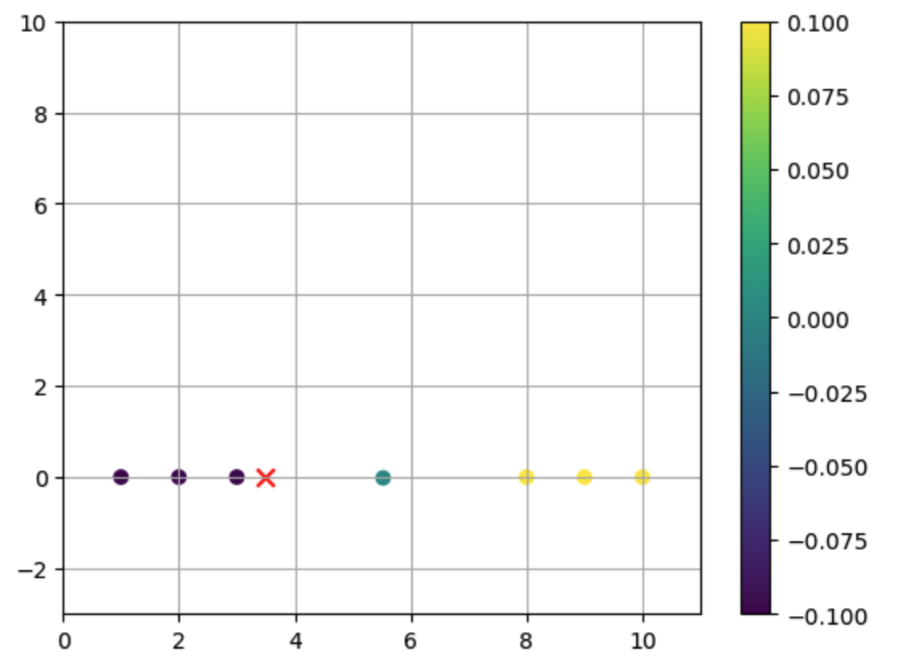
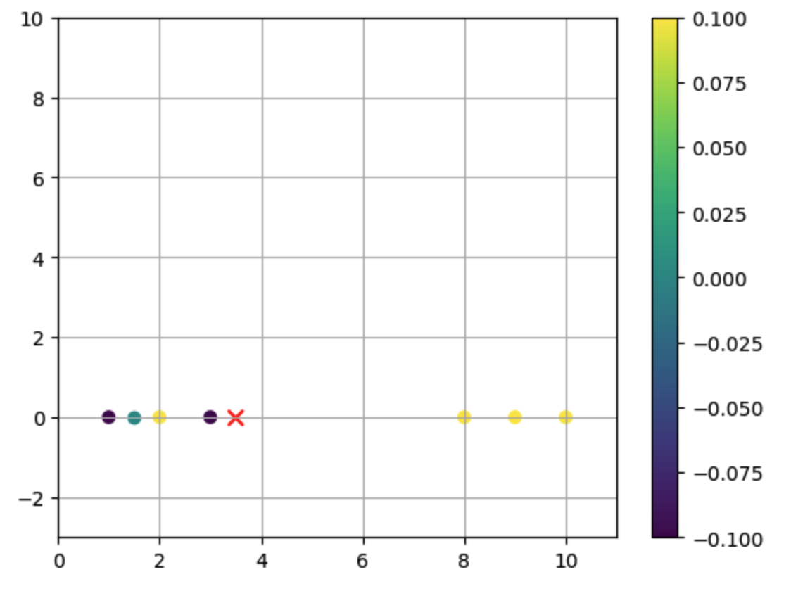

# Perceptron_Recreation

## Formulaic version

### Intro:

I created my own version of Perceptron. This version is formulaic, meaning it just uses a simple math equation. 

### How it works:

The Perceptron algorithm can distinguish from two different things. My formulaic Perceptron does this by taking the average of the last of the first item type and the first of the second item type.

This image demonstrates this very well, showing the devide. (X is the test data, and the cyan dot is the devide between the purple and yellow data.

### Some issues:

However, there are some issues with the formulaic version of Perceptron. If you have some bad data, formulaic programs can't work around it. This can be shown with this picture.

## Conclusion

Overall, I think this project was fun to make, but im going to make an algorithmic version of Perceptron next.
